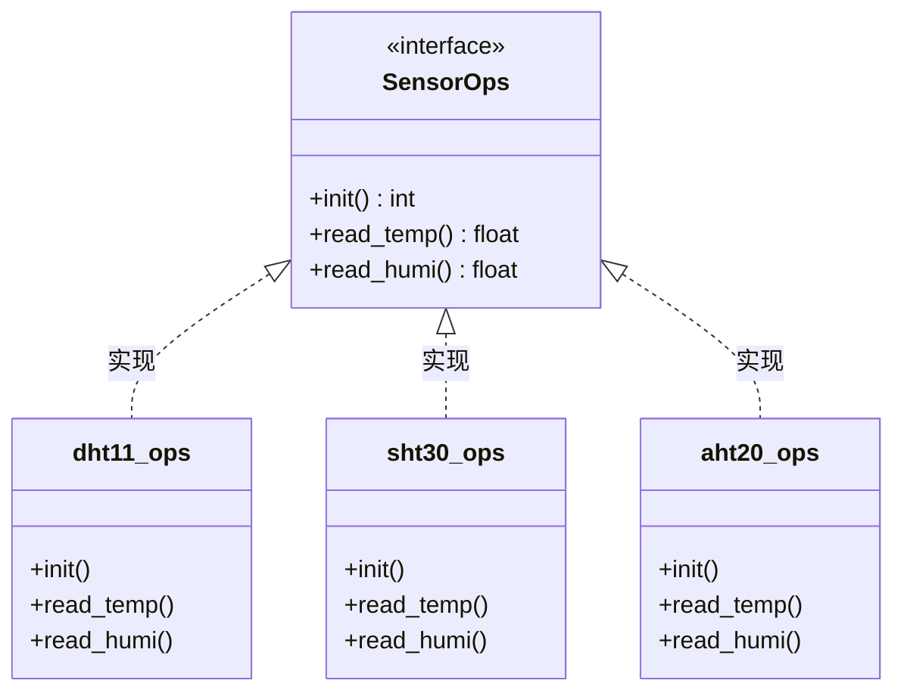

# 嵌入式设计模型

## 简介

引入设计模型主要解决的以下问题：

- 解耦：上、下层解耦、模块之间解耦。
  - 纵向：业务归业务，驱动归驱动；增加底层硬件时，不需要动到业务
  - 横向：模块之间通过队列、同步、事件等机制解决耦合，避免修改模块A、需要动到模块B
  - 可选设计模式：观察者模式
- 复用：避免重复造轮子。当出现多行代码复用率很高时，即可考虑抽象出作为一个接口功能，对外提供
- 扩展：新增功能，避免动老代码。新增同类型外设时，仅需要注册到已有代码即可
  - 可选设计模式：适配器模式、单例模式、工厂模式

其他模式

- 对象池模式：解决内存紧张时，需要malloc问题

## 工厂模型

针对多种同类型外设模式，最好的模式仅需增加新硬件驱动即可。

示例：支持多款温湿度传感器

- **抽象产品（Abstract Product）**：定义产品（如硬件驱动、传感器接口）的统一接口

- **具体产品（Concrete Product）**：实现抽象接口的具体硬件/驱动类（如UART驱动、I2C传感器驱动）

- **抽象工厂（Abstract Factory）**：声明创建产品的接口（如`create_driver()`）

- **具体工厂（Concrete Factory）**：实现抽象工厂接口，返回具体产品实例（如`UART_Factory`、`I2C_Factory`

### 简单的设计模式

#### 模型框架



#### 代码实现

##### DHT11实现

```
static int dht11_init(void)
{ 
	/* 硬件初始化代码 */
	return 0; 
}

static float dht11_read(void)
{ 
	/* 读取湿度代码 */
	return 60.0f;
}

sensor_ops_t dht11_ops = {"dht11", dht11_init, dht11_read};
```

##### DS18B20实现

```
static int ds18b20_init(void) 
{ 
	/* 硬件初始化代码 */
    return 0; 
}

static float ds18b20_read(void)
{ 
	/* 读取温度代码 */
	return 25.5f; 
}

sensor_ops_t ds18b20_ops = {"ds18b20", ds18b20_init, ds18b20_read};
```

##### 工厂接口实现

```C
/* 抽象产品：传感器驱动接口（头文件） */
typedef struct {
    const char *name;
    int (*init)(void);    // 初始化函数指针
    float (*read)(void);  // 读取数据函数指针
} sensor_ops_t;

typedef enum {
    SENSOR_DS18B20 = 0,
    SENSOR_DHT11,
    SENSOR_MAX
}sensor_type_t;

/* 声明 */
extern Sensor_Driver ds18b20_ops;
extern Sensor_Driver dht11_ops;

/* 工厂函数：根据传感器类型创建驱动实例 */
sensor_ops_t* sensor_factory(sensor_type_t sensor_type) {
    switch (sensor_type) {
        case SENSOR_DS18B20: return &ds18b20_ops;
        case SENSOR_DHT11:   return &dht11_ops;
        default:             return NULL;
    }
}

```

##### 应用层

```C
/* 使用示例 */
#include "sensor_factory.h"

int main() 
{
    sensor_ops_t* temp_sensor = sensor_factory(SENSOR_DS18B20);
    if (temp_sensor) {
        temp_sensor->init();
        float temp = temp_sensor->read();
        printf("Temperature: %.1f°C\n", temp);
    }
    return 0;
}
```

#### 弊端

- 新增传感器型号时，需修改工厂接口代码
- 无法动态发现所以相同传感器

### 自动注册方式（链表）

**耦合：底层需要调用注册接口**

##### 工厂接口

数据结构增加**指针next**

```C
// .h文件
typedef struct sensor_ops {
    const char *name;
    void (*init)(void);
    void (*read)(float *temperature, float *humidity);
    struct sensor_ops *next;
} sensor_ops_t;

// C文件
static sensor_ops_t gs_sensor_list = NULL;
/* */
void sensor_drv_register(sensor_ops_t *drv)
{
    if (!drv) {
        return;
    }   
    drv->next = gs_sensor_list;
    gs_sensor_list = drv;
}

void sensor_factory_init(void)
{
    // 注册传感器驱动
    printf("正在初始化传感器工厂...\n");
    dht11_register();
    ds18b20_register();
}

sensor_ops_t* sensor_factory_find(const char *name)
{
    sensor_ops_t *current = gs_sensor_list;
    while (current) {
        if (strcmp(current->name, name) == 0) {
            return current;
        }
        current = current->next;
    }

    return NULL; // 未找到匹配的传感器驱动
}

void sensor_get_count(void)
{
    int count = 0;
    sensor_ops_t *current = gs_sensor_list;
    while (current) {
        count++;
        current = current->next;
    }
    fprintf(stderr, "当前注册的传感器驱动数量: %d\n", count);
}

void sensor_dump(void)
{
    sensor_ops_t *current = gs_sensor_list;
    fprintf(stderr, "已注册的传感器驱动列表:\n");
    while (current) {
        fprintf(stderr, " - %s\n", current->name);
        current = current->next;
    }
}
```

##### 驱动接口

```
static int dht11_init(void)
{ 
	/* 硬件初始化代码 */
	return 0; 
}

static float dht11_read(void)
{ 
	/* 读取湿度代码 */
	return 60.0f;
}

sensor_ops_t dht11_ops = {"dht11", dht11_init, dht11_read};

/* 增加注册接口，注册到链表尾部 */
void dht11_register(void)
{
    sensor_drv_register(&dht11_ops);
}
```

### 嵌入式独有（Flash链接地址）

参考实现：**RT-Thread的初始化类似**

#### 链接器

如linker.md文件中可以将变量放大指定段（section），该方案就是考虑将同类型传感器的ops结构体地址全部放到同一个段内，工厂接口只需要遍历该段内的地址，找到对应传感器实现。

示例：

```
┌─────────────────── Flash 内存布局 ───────────────────┐
│                                                      │
│   .text  (代码段)                                    │
│   .rodata (只读数据)                                 │
│   ...                                                │
│                                                      │
│   ┌──────────────────────────────────────────────┐  │
│   │          .sensor_registry (自定义段)          │  │
│   │  ┌──────────┬──────────┬──────────┐          │  │
│   │  │ dht11_ops│ sht30_ops│ aht20_ops│  ...     │  │
│   │  └──────────┴──────────┴──────────┘          │  │
│   │  ↑                                    ↑      │  │
│   │  __sensor_start              __sensor_end    │  │
│   └──────────────────────────────────────────────┘  │
│                                                      │
│   .data (初始化数据)                                 │
│   .bss  (未初始化数据)                               │
│                                                      │
└──────────────────────────────────────────────────────┘
```

#### 实现步骤

##### 工厂接口

```C
# .h文件
#define REGISTER_SENSOR(sensor_ops) \
	__attribute__((used, section(".sensor_register"))) \
	static const sensor_ops_t * __sensor_##sensor_ops = &sensor_ops

/* 链接文件指定的段起始和结束地址 */
extern const sensor_ops_t * __start_sensor_registry;
extern const sensor_ops_t * __stop_sensor_registry;
```

```c
const sensor_ops_t * sensor_find(const char *name)
{
    const sensor_ops_t **ptr;
    
    for (ptr = &__start_sensor_registry; ptr < &__stop_sensor_registry; ptr ++) {
        if (strcmp((*ptr)->name, name) == 0) {
            return *ptr;
        }
    }
    return NULL;
}

int sensor_getcount(void)
{
    return (&__stop_sensor_registry - &__start_sensor_registry);
}

void sensor_printall(void)
{
    const Sensor_Ops **ptr;
    
    printf("已注册的传感器列表：\n");
    for (ptr = &__start_sensor_registry;
         ptr < &__stop_sensor_registry;
         ptr++) {
        printf("  - %s\n", (*ptr)->name);
    }
}
```

##### 驱动注册

```
static int dht11_init(void)
{ 
	/* 硬件初始化代码 */
	return 0; 
}

static float dht11_read(void)
{ 
	/* 读取湿度代码 */
	return 60.0f;
}

Sensor_Driver dht11_ops = {"DHT11", dht11_init, dht11_read};

REGISTER_SENSOR(dht11_ops)
# 展开：__Sensor_dht11_ops = &dht11_ops
```

##### 业务接口

```c
int main(void)
{
    // 打印所有已注册的传感器
    printf("系统共注册了 %d 个传感器\n", sensor_getcount());
    sensor_printall();

    // 按名字获取传感器
    const sensor_ops_t *sensor = sensor_find("DHT11");
    if (sensor) {
        sensor->init();
        printf("温度: %d°C\n", sensor->read());
    }

    return 0;
}
```

###### 条件编译

```
#ifdef PRODUCT_PRO
    #include "sht30.c"      // Pro 版包含 SHT30 驱动
#endif

#ifdef PRODUCT_LITE
    #include "dht11.c"      // Lite 版包含 DHT11 驱动
#endif

#ifdef PRODUCT_INDUSTRIAL
    #include "pt100.c"      // 工业版包含 PT100 驱动
#endif
```

**该模型的实用性**：待评估，因为实际工程只会集成一款硬件

### 基于自动注册+嵌入式方案

核心思想：数组+指针 -> 模拟链接器中的section段

##### 工厂接口

**仅限制数量**，自动注册方式章节的注册接口也可以用

```
#define  MAX_SENSOR_NUM   3

static const sensor_ops_t *ps_sensor_table[MAX_SENSOR_NUM];
static char gs_sensor_count = 0;

// 改写注册
void sensor_drv_register(sensor_ops_t *drv)
{
    if (!drv || gs_sensor_count > MAX_SENSOR_NUM) {
        return;
    }   
    
    ps_sensor_table[gs_sensor_count ++] = drv;
}

sensor_ops_t* sensor_factory_find(const char *name)
{
	for (char i = 0; i < gs_sensor_count; i ++)
    sensor_ops_t *current = ps_sensor_table[i];
        if (strcmp(current->name, name) == 0) {
            return current;
    }
    
    return NULL; // 未找到匹配的传感器驱动
}
```

##### 驱动(关键)

__attribute__((constructor))：修饰可保证该接口先于main接口

```
static void __attribute__((constructor)) dht11_auto_register(void)
{
    sensor_drv_register(&dht11_ops);
}
```

## 适配器模式

即硬件抽象层，用来适配不同厂家、不同芯片的接口


## 单例模式

其保证了整个系统中某个对象只有一个实例，而且提供一个全局的访问点。比如硬件资源


## 对象池模式

解决嵌入式malloc带来的内存不足、内存碎片等问题

核心思路：预先分配固定数量且同等大小的内存池，malloc实际上是向该内存池申请，free即规划到该池子中

实现思路：可参考RT-thread、freeRTOS中的内存池实现

## 观察者模式

解决模块之间耦合的问题

核心思路：订阅-发布，事件模块发布某事件，关心该事件的其他模块订阅

### 观察者模式（Observer Pattern）

> 当某个“被观察对象（Subject）”发生变化时，
>
> **自动通知所有关心它的“观察者（Observer）”**

| 软件概念 | 嵌入式含义                        | 职责                           |
| -------- | --------------------------------- | ------------------------------ |
| Subject  | 传感器 / 状态机 / 硬件事件        | 维护观察者列表，状态变化时通知 |
| Observer | 任务 / UI / 存储 / 通信模块、日志 | 接收通知并执行相应业务逻辑     |
| Notify   | 回调 / 消息 / 队列                | 统一的接口定义                 |

新增功能模块时，只需实现Observer接口并注册，无需修改已验证的驱动代码

### 观察者模式 VS  订阅发布模式

| 维度         | 观察者模式                          | 发布-订阅模式              |
| ------------ | ----------------------------------- | -------------------------- |
| **耦合度**   | 松耦合（Subject直接调用、接口耦合） | 完全解耦（通过Broker中转） |
| **通信方式** | 同步直接调用                        | **异步消息队列**           |
| **资源开销** | 极低（仅指针存储）                  | 较高（Broker + 队列）      |
| **适用场景** | 资源受限、同步通知需求、性能敏感    | 较复杂系统、允许异步       |

**结论**：对于RAM小于64KB的Cortex-M0/M3系统，观察者模式以其"零拷贝"特性成为首选

### 示例

以按键事件为例：

- 被观察者：按键

- 观察者：led模块，按键按下时点亮，弹起时灯灭

#### 观察者模式

##### 被观察者接口

```C
# .h文件
// 事件类型定义
typedef enum {
	KEY_EVENT_PRESSED = 0,
	KEY_EVENT_LONG_PRESSED,
}key_event_t;

// 事件回调接口定义
typedef void (*key_observer_callback)(key_event_t event);
#define MAX_OBSERVERS   4
typedef struct {
    key_observer_callback  callback[MAX_OBSERVERS];
    int num;
}key_observer_t;

// 注册观察者
void key_observer_register(key_observer_callback cb);
    
# .c文件

static key_observer gs_key_observers;

// 注册观察者
void key_observer_register(key_observer_callback cb)
{
    if (cb && gs_key_observers.observer_num < MAX_OBSERVERS){
        gs_key_observer.callback[gs_key_observers.num ++] = cb;
    }
}

// 事件通知，观察者回调
void key_notify(key_event_t event)
{
    for (int i = 0; i < gs_key_observers.num, i++){
        if (gs_key_observers.callback[i]) {
            gs_key_observers.callback[i](event);
        }
    }
}

void key_scan(void)
{
    // 获取key状态，且转换成事件（过滤）
    key_event_t event = 0;
    
    key_notify(event);
}
```

##### 观察者接口

```
# .c
void led_handle_for_key_event(key_event_t event)
{
	// 事件业务处理
    if (event == KEY_EVENT_PRESSED) {
        fprintf(stderr, "LED ON\n");
    } else if (event == KEY_EVENT_LONG_PRESSED) {
        fprintf(stderr, "LED BLINK\n");
    }
 }
```

##### 测试接口

```
void observer_pattern_test(void)
{
	// 模拟短按键
    set_key_state(KEY_PRESSED);
    key_scan();
    set_key_state(KEY_RELEASED);
    key_scan();
    sleep(3);
}
```

#### 发布-订阅模式

核心：异步队列通知

- 事件发布者提供发布事件接口（即写入队列），数据内容包含

##### 发布者

```
#.h
typedef enum
{
    KEY_EVENT_PRESSED = 0,
    KEY_EVENT_LONG_PRESSED,
} event_id_t;

 typedef struct {
      event_id_t event_id; // 按键事件
      int key_id;  // 按键编号   
 }key_event_t;
 
# .c
# 发布事件
void key_publish(key_event_t *event)
{
    if (event == NULL) {
        return;
    }
    queue_enqueue(&gs_key_event_queue, event);
}

// 事件订阅
void key_event_subscribe(void (*cb)(key_event_t event))
{
    if (cb_cnt < MAX_SUBSRIBE) {
        callback[cb_cnt++] = cb;
    }
}

// 读取订阅回调
void key_event_loop(void)
{
    key_event_t event;
    if (queue_dequeue(&gs_key_event_queue, &event) == 0) {
        for (int i = 0; i < cb_cnt; i++) {
            if (callback[i]) {
                callback[i](event);
            }
        }
    }   
}

# 事件触发
void key_scan(void)
{
    // 获取key状态，且转换成事件（过滤）
    key_event_t event = {0};
    
    key_publish(&event);
}
```

##### 订阅

```
key_event_subscribe(led_handle_for_key_event);
```

